# Architecture Diagram

```mermaid
graph TB
    %% Frontend Layer
    subgraph "Frontend Layer"
        UI[HTML Templates<br/>Jinja2]
        JS[JavaScript<br/>Navigation, Drafts, File Upload]
        CSS[CSS Styles<br/>Responsive Design]
    end

    %% Flask Application Layer
    subgraph "Flask Application Layer"
        APP[Main App<br/>app.py]

        subgraph "Blueprints (Modules)"
            HIER[Hierarchy BP<br/>AHP Method]
            BINARY[Binary Relations BP<br/>Binary Analysis]
            EXPERTS[Experts BP<br/>Expert Evaluation]
            LAPLASA[Laplasa BP<br/>Laplace Criterion]
            MAXIMIN[Maximin BP<br/>Maximin Criterion]
            SAVAGE[Savage BP<br/>Savage Criterion]
            HURWITZ[Hurwitz BP<br/>Hurwitz Criterion]
            DRAFTS[Drafts BP<br/>Save/Restore Work]
        end
    end

    %% Business Logic Layer
    subgraph "Business Logic Layer (mymodules/)"
        METHODS[Mathematical Methods<br/>Calculations & Algorithms]
        PARSER[File Parser<br/>Excel/CSV Processing]
        EXPORT[Excel Export<br/>Data Export]
        VISUAL[Visualization<br/>Plotly Charts]
        GPT[GPT Integration<br/>AI Analysis]
    end

    %% Database Layer
    subgraph "Database Layer (PostgreSQL)"
        subgraph "User Management"
            USERS[Users Table<br/>Authentication]
        end

        subgraph "Method-Specific Tables"
            HIER_DB[Hierarchy Tables<br/>Criteria, Alternatives, Matrices]
            BINARY_DB[Binary Tables<br/>Names, Matrix, Rankings]
            EXPERTS_DB[Experts Tables<br/>Research, Competency, Data]
            LAPLASA_DB[Laplasa Tables<br/>Conditions, Alternatives, Cost Matrix]
            MAXIMIN_DB[Maximin Tables<br/>Conditions, Alternatives, Cost Matrix]
            SAVAGE_DB[Savage Tables<br/>Conditions, Alternatives, Cost Matrix]
            HURWITZ_DB[Hurwitz Tables<br/>Conditions, Alternatives, Cost Matrix]
        end

        subgraph "Audit & Tracking"
            RESULTS[Results Table<br/>Audit Trail]
            DRAFTS_DB[Drafts Table<br/>Work in Progress]
        end
    end

    %% External Services
    subgraph "External Services"
        FILES[File Upload<br/>Excel/CSV Files]
        AI[AI Service<br/>GPT Analysis]
    end

    %% Connections
    UI --> APP
    JS --> APP
    CSS --> UI

    APP --> HIER
    APP --> BINARY
    APP --> EXPERTS
    APP --> LAPLASA
    APP --> MAXIMIN
    APP --> SAVAGE
    APP --> HURWITZ
    APP --> DRAFTS

    HIER --> METHODS
    BINARY --> METHODS
    EXPERTS --> METHODS
    LAPLASA --> METHODS
    MAXIMIN --> METHODS
    SAVAGE --> METHODS
    HURWITZ --> METHODS

    METHODS --> PARSER
    METHODS --> EXPORT
    METHODS --> VISUAL
    METHODS --> GPT

    HIER --> HIER_DB
    BINARY --> BINARY_DB
    EXPERTS --> EXPERTS_DB
    LAPLASA --> LAPLASA_DB
    MAXIMIN --> MAXIMIN_DB
    SAVAGE --> SAVAGE_DB
    HURWITZ --> HURWITZ_DB
    DRAFTS --> DRAFTS_DB

    HIER --> RESULTS
    BINARY --> RESULTS
    EXPERTS --> RESULTS
    LAPLASA --> RESULTS
    MAXIMIN --> RESULTS
    SAVAGE --> RESULTS
    HURWITZ --> RESULTS

    APP --> USERS
    DRAFTS --> USERS

    PARSER --> FILES
    GPT --> AI

    %% Styling
    classDef frontend fill:#e1f5fe
    classDef flask fill:#f3e5f5
    classDef business fill:#e8f5e8
    classDef database fill:#fff3e0
    classDef external fill:#fce4ec

    class UI,JS,CSS frontend
    class APP,HIER,BINARY,EXPERTS,LAPLASA,MAXIMIN,SAVAGE,HURWITZ,DRAFTS flask
    class METHODS,PARSER,EXPORT,VISUAL,GPT business
    class USERS,HIER_DB,BINARY_DB,EXPERTS_DB,LAPLASA_DB,MAXIMIN_DB,SAVAGE_DB,HURWITZ_DB,RESULTS,DRAFTS_DB database
    class FILES,AI external
```

## Key Features

### 🔄 **Data Flow**
1. **User Input** → Frontend (HTML/JS)
2. **Request Processing** → Flask Blueprints
3. **Business Logic** → Mathematical Methods
4. **Data Storage** → PostgreSQL Database
5. **Response** → Frontend Display

### 🏗️ **Architecture Layers**
- **Frontend Layer**: User interface and interactions
- **Flask Application Layer**: Request routing and module organization
- **Business Logic Layer**: Core algorithms and data processing
- **Database Layer**: Data persistence and audit trails
- **External Services**: File handling and AI integration

### 🔐 **Security & Audit**
- **User Authentication**: Flask-Login with password hashing
- **Audit Trail**: Complete tracking of all user actions
- **Data Isolation**: Users can only access their own data
- **Connection Pooling**: Optimized database performance

### 📊 **Scalability Features**
- **Modular Design**: Easy to add new decision methods
- **Blueprint Architecture**: Horizontal scaling support
- **Connection Pooling**: Database efficiency (10 base + 20 overflow connections)
- **Stateless Design**: Session-based user management
